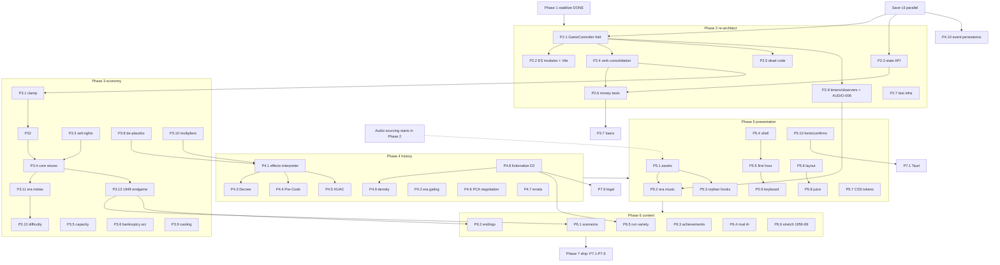

# MOGUL 3.0 — Execution Roadmap, Phases 2–7

**Source of truth:** `docs/BUILD-PLAN-3.0.md` (phases/gates) + `docs/AUDIT-REPORT.md` + workstream reports in `docs/audit/` (ECON, DESIGN, CODE, HIST, UX-SHIP, AUDIO, TEST). Every task cites the finding IDs it resolves.

**Status:** Phase 0 (audit) and Phase 1 (stabilize) COMPLETE. Phase 1 closed: unified week/month tick + double-billed overhead (CODE-001, ECON-002/003, DESIGN-005/006, UX-002), EventBus.clear() wipe (CODE-002), crash quartet (CODE-003/004/005, UX-001/003/004, DESIGN-001, AUDIO-002), frozen HUD (UX-004), distribution-global race (ECON-009), rival init vs discarded state (CODE-011), loan-processing call sites (ECON-004 wiring / DESIGN-003 call-name), AudioContext resume + 404 gating (AUDIO-003/004), global error boundary (CODE-010), deleted `js/systems/unused/` + `js/ui/modals.js` (CODE-012, part of CODE-014). **Save v3** (full-state serialization, migrations, quota handling — CODE-007/008/009, TEST-003, HIST-011) lands in parallel; tasks below that touch state shape must rebase on it. The sim harness (`tests/sim/`, `npm run sim`) is the permanent balance gate. Game remains UNWINNABLE (ECON-001) until Phase 3.

**Status update (end of Phases 2–3):** Phases 2 and 3 are COMPLETE with recorded deviations. Phase 2 delivered P2.1 (GameController folded into the live tick and deleted — crisis/TV/achievements/era transitions now fire), P2.4 (one owner per verb: greenlight through censorship, `releaseFilm` the sole distribution executor, dashboard owns distribute/loan clicks, time buttons single-fire; plus the film-id collision fix), P2.5, P2.7 (honest passing coverage thresholds), and P2.8-lite (dashboard event-driven + lifecycle-safe teardown; audio/tutorial polls deferred to Phase 5 with AUDIO-006). Phase 3 delivered P3.1 era-scaled ceiling, P3.2 era-scaled marketing, P3.3 sell-rights quality floor, P3.4 tuning (pinned by tests/sim/balance-gates.test.js), P3.5 sound-stage capacity + studio-lot revenue perk, P3.6 receivership arc, P3.7 takeLoan API + mob-favor collection, P3.13 1949 endgame with legacy-scored epilogue — plus a production-values budget curve (gross now scales with budget; root cause of cheap-film ROI dominance). Era metas: docs/ERA-META.md.

**Deviations:** P2.2 (ESM/Vite) deferred to pre-ship (Phase 7): no player value before packaging, breaks the sim-harness loader, contradicts the checked-in no-build-step rule; istanbul-visible ≥80%/system (P2.6 gate) moves with it — harness-exercised code is invisible to istanbul, so behavioral money-path tests live in tests/sim/money-paths.test.js instead. P2.3's full rogue-writer sweep is partially done via verb consolidation; the remainder plus P3.8–P3.12 (choice-consequence de-placebo, casting lever, remaining dangling multipliers, era-meta deepening, difficulty settings) roll into Phase 4 where their content lives.

**Status update (end of Phases 4–5):** Phase 4 is COMPLETE: P4.1 classified effects interpreter (zero silent drops, test-enforced), P4.2 era gating, P4.3 Decree divestiture, P4.4 real pre-Code window, P4.5 HUAC long tail, P4.7 all 21 errata rows, P4.8 full fictionalization (173 personas, 91 titles, pastiche studios; packet in docs/FICTIONALIZATION-MAP.md), P4.9 density floor ≥6 events/yr 1933–49 (33 new month-accurate events reproducing the real attendance curve), P4.10 event persistence, plus P3.8 de-placebo and DESIGN-014 salary fix. Phase 5 delivered: P5.1-in-session (generative WebAudio period score — 8 era styles — plus a 26-hook synth SFX table; licensed recordings can replace wholesale via FILE_AUDIO_ENABLED), P5.2 canonical era→track map (test-pinned per year), P5.3 orphan/phantom hooks wired, P5.4 title menu + studio naming + 400ms boot (was 3s), P5.6 pinned action bar, P5.8-lite (animated cash HUD, event-driven SFX on every verb), P5.9-lite (Space advances), P5.10 fonts self-hosted (offline-complete; zero external requests), UX-006 tutorial collision fixed (starts after the campaign, Escape closes), AUDIO-006 audio integration fully event-driven.

**Phase 4–5 remainder (tracked, honest):** P4.6 seal-denial negotiation (finalPCAReview still uncalled); P5.5 full scripted-first-year tutorial (collision + Escape fixed; rebuild pending); P5.7 bulk hex→token migration (tokens + contrast landed; 546 literals remain); P5.10 confirm()/alert() replacement (5 sites); P5.9 full keyboard coverage; licensed audio recordings + AUDIO_CREDITS (synth score ships meanwhile). The blind first-hour human test remains the outstanding exit-gate obligation.

Sizes: S ≤ half-day, M ≤ 3 days, L ≤ 2 weeks (1 dev + agents).

---

## Decisions D1/D2 (as recorded in AUDIT-REPORT §Decisions) and per-phase implications

**D1 — Ship deep 1933–1949 first.** Density cliff measured (HIST-002: 71/116 events, 148/284 script templates, 102/174 talent windows all concentrated 1933–49; 13 scripts for the whole 1950s). 1950–69 is a stretch goal inside 3.0 (Phase 6); post-1969 is expansion/DLC on a branch.

**D2 — Fictionalize the roster.** Confirmed non-optional (HIST-007: 174/174 real people, ~25 living, scandal odds/quirks attached; ~91 verbatim real film titles). Real institutions/events stay (Hays Office, HUAC, Decree); studios become renamed pastiche.

| Phase | D1 implication | D2 implication |
|---|---|---|
| 2 | None structural — conversion keeps all era data; post-1949 data preserved, not deleted | None |
| 3 | Tune 1933–49 only; `GAME_END_YEAR` → 1949 + real win condition (HIST-014); era-scaling utilities still written generically | Casting lever (P3.9) built against archetype schema, not real names |
| 4 | Density floor applies to 17 years, not 77 (≥6 ev / 8 scripts / 4 talent per year); post-1949 effect keys wired but dormant | Roster fictionalization + rename ~91 verbatim titles is a Phase 4 content task (P4.8) |
| 5 | Audio needs **8** tracks (menu, pre_code, code_era, war_era, post_war, tension, success, crisis), not 16 — matches the original AUDIO_GUIDE plan | Title screen/marketing art: no real likenesses |
| 6 | All scenarios inside 1933–49; 1950–69 extension is the stretch task | Per-run talent generation only possible because roster is archetypal |
| 7 | Store copy says 1933–1949; CLAUDE.md/README updated (HIST-014) | Legal sign-off is verification of the fictionalization, not a new decision ($500–1.5k consult stays budgeted) |

---

## Phase 2 — Re-architect

**Objective.** Make every later phase cheap: one module system, one state API, one owner per verb, and a regression net under the money paths. Nothing in this phase changes balance; behavior must be identical modulo the hooks it deliberately brings to life.

**Entry criteria:** Phase 1 exit gate green (`npm test`, hostile protocol clean); save v3 merged or its state-shape frozen (P2.3/P2.6 depend on it).

| ID | Task | Findings | Files / functions | Acceptance criteria | Size | Deps |
|---|---|---|---|---|---|---|
| P2.1 | **GameController resolution**: fold its unique logic into the live pipeline — `checkEraTransition` + `era:changed` emission (game-controller.js:75-77,286-305), `TVCompetitionSystem.checkForTvEvents` (:251), weekly `AchievementSystem.checkAchievements` (:193,246), weekly `RivalStudios.processWeeklyRivalUpdates` (:188) — then **delete game-controller.js** (401 lines, own crash at :180). Wire `CrisisSystem.checkForCrisis` (crisis.js, zero callers) into the same tick — Phases 3/4 need `near_bankruptcy` and HUAC crises. | CODE-006, DESIGN-005, part CODE-014 | js/core/game-state.js (tick pipeline :234-376), js/core/game-controller.js (delete), js/systems/crisis.js, js/systems/tv-competition.js, js/systems/rival-studios.js, js/systems/achievements.js | `grep -rn GameController js/ index.html` = 0 hits; era-transition modal fires at 1934→1935; achievements checked weekly (test); `checkForCrisis` invoked per tick (test); sim run pre/post identical except a documented delta list of newly-live hooks | M | save v3 (crisis state persists) |
| P2.2 | **ES modules + Vite (D4)**: convert per CODE.md dependency graph (no eval-time cross-reads ⇒ mechanical). Rework the 4 DOMContentLoaded self-initializers (tutorial-integration:100, visual-enhancements:10, audio-integration:241, integration:517), the 2 `updateDashboard` monkey-patch chains, `dashboard-talent-addon.js` implicit globals (fold into dashboard modules per BUILD-PLAN), and ~20 inline `onclick="System.method()"` strings → delegated listeners. Delete the 44 script tags. | D4; CODE.md §Dependency graph; BUILD-PLAN Phase 2 dashboard-addon consolidation | index.html:507-558, all js/**, new vite.config.js; dashboard-talent-addon.js, dashboard-rival-extensions.js, dashboard-visuals.js → js/ui/dashboard/ modules | `npm run dev` + `npm run build` work; built game passes `npm run sim -- --matrix` with same outputs as pre-conversion (same seed); zero `window.X` cross-module reads outside one compat shim (grep); `index.html` still the entry point | L | P2.1 (don't convert a file about to be deleted), P2.4 (inline onclick owners) |
| P2.3 | **Single state API**: all writes through game-state actions; fix the rogue writers (direct mutation in 20 of 23 modules — CODE.md §Rogue state writers). Unify: `reputation` (8 writers, inconsistent clamping), `monthlyBurn` (3 writers), the two loan ledgers (`finances.loans` vs `loans`). | CODE.md rogue-writer census; DESIGN-003 ledger split | js/core/game-state.js (action surface), financial.js:134,472; boxoffice.js:446-487; production.js:716-731,1001; scenarios.js:429-512; events.js, censorship.js, awards.js, crisis.js, studio-lot.js, technology.js, franchise.js | Lint rule or grep: `gameState\.\w+ *[+\-]?=` outside game-state.js ≤ explicit allowlist; one `setReputation` with clamp; one loan ledger; EventBus is the only cross-system channel | L | save v3 (field names final); before P2.6 tests freeze APIs |
| P2.4 | **One owner per verb**: consolidate 4 greenlight paths → 1 (through censorship: `Integration.handleScriptGreenlight`), 3 distribution flows → 1 (`BoxOfficeSystem.releaseFilm`, era-scaled, affordability-checked; delete the production.js:635-753 legacy modal), 2 burn/runway calculators → 1, 3 private `getAllFilms` copies → 1 exported query, 2 save-apply implementations → 1. **Fix CODE-013 here**: undeclared `gameState` at integration.js:355 (ironman + censorship-flagged greenlight) was masked by CODE-005 and is armed now that Phase 1 fixed the earlier throw. | CODE-015, DESIGN-009, CODE-013 | production.js:635-753,972; scripts.js:2863; dashboard.js:645,790-806; integration.js:249,392-448; boxoffice.js:432+; save-load-ui.js:379 vs keyboard-shortcuts.js:129 | Exactly one code path per verb (grep-verified); censorship evaluation runs on 100% of greenlights (unit test); displayed projections match executed economics (test comparing modal numbers to `releaseFilm` results) | L | P2.1 |
| P2.5 | **Dead-code remainder**: delete `js/core/dom-utils.js` (nothing reads DOMUtils), `TimeSystem.checkForHistoricalMilestones` (dead + wrong facts). Keep `visual-event-triggers.js` (Phase 5 juice layer depends on its CustomEvents — UX-SHIP §Feedback) and crisis.js (revived in P2.1). | CODE-014 (rest), HIST-010 | js/core/dom-utils.js, js/core/time-system.js:244-302 | grep for `DOMUtils`, `checkForHistoricalMilestones` = definitions gone, 0 refs; `npm test` green | S | P2.1 (crisis decision) |
| P2.6 | **Money-path unit tests** (TEST top-10): extract pure functions first per TEST-004 (`computeLoanTerms(amount,type)` out of financial.js:375-442; `applyDistributionChoice(film,strategy,gameState)` out of production.js:703-731; ceremony-compute vs modal in awards.js:472-515). Order: EASY (studio-lot, talent-management, rival-studios, save-load) → MEDIUM (boxoffice calculators, censorship evaluators, events.applyChoiceEffects, game-state, awards) → the extracted HARD pair. | TEST-001, TEST-004; top-10 table in TEST.md §Top-10 | tests/*.test.js (new); financial.js, boxoffice.js, production.js, game-state.js, save-load.js, events.js, studio-lot.js, talent-management.js, censorship.js, awards.js | Statement coverage ≥80% on each of financial/boxoffice/production/awards/censorship/game-state (per-file, `npm run test:coverage`); every function that adds/removes cash has ≥1 test asserting exact delta (not `<` — TEST-007) | L | P2.3/P2.4 (test the consolidated paths, not the doomed ones) |
| P2.7 | **Test-infra repair**: per-directory coverage thresholds that pass and ratchet (TEST-002); replace constant/pixel-string assertions with invariants (TEST-005); fix setup.js localStorage mock, stale mock state, swallowed console.error (TEST-006); coverage config excludes deleted dirs (TEST-008). | TEST-002/005/006/008 | jest.config.js, tests/setup.js, tests/game-state.test.js:61-70,318-355, tests/systems.test.js:41-49,635-640,1197-1206 | `npm run test:coverage` exits 0; changing one balance constant breaks 0 tests (spot-check STARTING_CASH); setup.js mock round-trips values | M | — |
| P2.8 | **Timer/observer lifecycle**: `destroy()` per system called on restart; replace polls with EventBus subs — dashboard 3s interval (dashboard.js:34), tutorial 5s (tutorial-integration.js:88), audio 1s cash-poll + 5s era-poll + MutationObserver (audio-integration.js:106-154 — this is AUDIO-006 and unblocks P5.2). | CODE-016, AUDIO-006 | dashboard.js, tutorial-integration.js, audio-integration.js, game-state.js domListeners registry (:83,130-137) | After "START NEW STUDIO" restart, active interval/observer count identical to first boot (jsdom test); audio reacts to `era:changed`/`financial:updated`, no polls | M | P2.1 (events exist) |

**Exit gate** (sharpened from BUILD-PLAN Phase 2): game runs identically pre/post conversion — `npm run sim -- --matrix --seeds 5` outputs comparable given same seed, with an explicit, reviewed delta list for hooks P2.1 activated (BUILD-PLAN's "byte-comparable" is unattainable once dead hooks go live — corrected here); coverage on money modules ≥80% (`npm run test:coverage` exits 0); no `window.*` cross-module reads outside the compat shim.

---

## Phase 3 — The economy (pillar 1)

**Objective.** Turn 50/50 bankruptcies into a tuned, dangerous, winnable 1933–1949 campaign: skilled play cash-positive, passivity fatal, no dominant strategy, every era meta distinct. Every task ends with a sim run; the sim is law.

**Entry criteria:** Phase 2 exit gate green (single distribution/greenlight path, money tests in place — retuning without them re-opens TEST-001's trap); `npm run sim` wired in CI.

| ID | Task | Findings | Files / functions | Acceptance criteria | Size | Deps |
|---|---|---|---|---|---|---|
| P3.1 | **Kill the $900k clamp**: era-scale `DISTRIBUTION_STRATEGIES` potentials or replace with a soft cap relative to budget/era (clamp at boxoffice.js:390-394 binds past ~$400k budgets even in-scope). | DESIGN-002, part ECON-001 | js/systems/boxoffice.js:140-166,390-394; js/core/constants.js:196-208 | A quality-85 film in 1948 with a $600k budget can gross >1.5× budget (unit test); no fixed dollar ceiling independent of era (grep) | M | P2.4 (single release path) |
| P3.2 | **Era-scale marketing/distribution costs** + theater counts via one utility (costs currently hardcoded 1933 dollars while burn scales). | ECON-007 | boxoffice.js releaseFilm marketing (:474-480 post-P2.4); constants.js getEraScalingForYear | All money constants flow through the era-scaling utility (test enumerates); 1949 wide-release marketing ≠ 1933's $25k | S | P3.1 |
| P3.3 | **Sell-rights retune**: replace deterministic 0.6×budget loss with quality/genre/timing-dependent floor (a real fallback, not a trap). | ECON-005 | production.js:930 / applyDistributionChoice (extracted in P2.6) | Sell-rights expected value spans ~0.5–1.1× by quality (unit test over the curve); sim: sell-heavy strategy survives longer than v2 baseline but underperforms release play | S | P2.6 extraction |
| P3.4 | **Core return-curve + burn retune**: starting cash / monthly burn / film ROI so conservative play ≈ break-even, skilled play compounds, do-nothing dies (ECON.md arithmetic: was +$1.5k/wk/film vs $5k/wk burn). | ECON-001, ECON-005 | constants.js, production.js budgets, boxoffice.js curves; tests/sim thresholds | `npm run sim -- --matrix --seeds 10`: do-nothing 10/10 bankrupt; conservative ≥6/10 reach 1949; prestige median survival ≥1945; no strategy >1.5× field ROI | L | P3.1–P3.3 |
| P3.5 | **Production capacity + studio lot payoff**: gate concurrent productions on `soundStages`; wire `getQualityBonus`/`getRevenueBonus`; map `studioLot.backlots` → `hasRelevantBacklot` discount. | ECON-006, DESIGN-013 | production.js:53-140 startProduction, :820-829; scripts.js:2863 greenlightScript; studio-lot.js:379-465 | Greenlight blocked at capacity with clear UI message (test); buying a stage raises the cap (test); sim exploit strategy can no longer run 8 parallel films on 1 stage | M | P2.4 |
| P3.6 | **Bankruptcy arc, not cliff**: negative cash opens an N-week receivership window (forced borrowing / asset fire-sale / `near_bankruptcy` crisis from P2.1) before game over; affordability gating on event/marketing debits (production.js:530-531,717,724 can currently overdraft in one click). | ECON-008, DESIGN-016 | game-state.js:382-392 checkGameEndConditions; crisis.js:161-204; production.js debit sites | cash<0 no longer ends game same tick (test); unaffordable event choices disabled/flagged; sim: median "warning→death" gap ≥8 weeks | M | P2.1 (crisis live) |
| P3.7 | **Loan economy teeth**: reachable loan UI (buttons call nonexistent `FinancialSystem.takeLoan` — route to the showLoanOptions chain), interest/principal actually bite (processing wired in Phase 1), default/mob-retaliation consequences, credit rating. | DESIGN-004, ECON-004 (economics), DESIGN-003 (investments pay out) | financial.js:154-216,221,434; dashboard.js:818; integration.js:455-456 | Loan take→repay round-trip test with exact interest; carrying max mob debt for 24 months triggers consequences (test); sim exploit strategy no longer immortal (dies or repays) | M | P2.3 (one ledger), P2.6 (computeLoanTerms) |
| P3.8 | **De-placebo player choices**: one film-effect setter API; events/censorship/crisis write `currentQuality`/`delayWeeks`/`spentToDate` and a consumed `boxOfficeMultiplier` instead of the orphan fields `film.quality`/`weeksRemaining`/`budgetSpent`/`boxOfficeMultiplier` written-never-read today. | DESIGN-007 | events.js:2786-2836; censorship.js:493-495; crisis.js:554-572; production.js:542,869,159; boxoffice.js revenue path | For every effect key in the 50-event deck: trigger→assert film state + final revenue change (table-driven test); zero writes to the orphan field names (grep) | M | P2.4 |
| P3.9 | **Casting as a lever**: casting step in greenlight via `greenlightScriptWithTalent`; write `film.cast` so star power reaches revenue (reader exists at boxoffice.js:231-235, field never written); charge weekly contract salaries + expiry (contracts store `weeklyRate`, burn reads nonexistent `monthlySalary`). | DESIGN-008, DESIGN-014 | talent-management.js:43-63,135,258-281,391; dashboard.js:682,704; game-state.js:307-311; production.js:786-818 (remove 4-name random cast) | Player chooses lead+director at greenlight (UI test); star power moves projected revenue (unit test); contracts drain cash weekly and expire (test); no more Garbo-random-cast | L | P2.2 (dashboard modules), P2.3, D2 schema |
| P3.10 | **Consume dangling multipliers**: TV penalty (era-relevant from 1948), franchise sequel multiplier, Oscar box-office bump, tech revenue bonuses, MPAA audienceMultiplier (dormant pre-1968, wired generically), rival `competitionPenalty`. | DESIGN-011/012/018, DESIGN-010 (economic half) | boxoffice.js:254-292 modifiers (live path post-P2.4); awards.js:859-872; franchise.js:23-41; rival-studios.js:369-375,458-466 (era-scale budgets) | Each multiplier has a test proving it changes revenue in the live path; sequel of a hit outgrosses equal-quality original (test); rivals release films that dent player revenue (sim) | M | P2.4, P2.1 (rival tick) |
| P3.11 | **Era metas + period sinks (1933–49)**: Pre-Code freedom → 1934 Code compliance tax; WWII draft/rationing + war-picture demand; post-war boom then 1947–49 contraction; sinks: star raises, theater-chain upkeep (pre-Decree), union agreements, tech adoption (sound→color). Write the "era meta" doc. | BUILD-PLAN Phase 3; ECON-010 setup; DESIGN-015 (in-scope half) | constants.js era tables; boxoffice.js GENRE_HEAT; scripts.js era weighting; new docs/ERA-META.md | ERA-META.md exists; sim strategy ranking differs between 1933–34, 1942–45, 1946–49 windows (matrix comparison); at least one new decision *type* per era | L | P3.4 |
| P3.12 | **Risk texture + difficulty settings**: fair flops (foreshadowed weather/scandal/competing releases); 3 difficulty levels tuned via sim thresholds, not bare multipliers. | BUILD-PLAN Phase 3 | events.js, boxoffice.js variance, new difficulty config | Sim per difficulty: easy conservative ≥8/10 survive, hard ≤4/10; flop of a quality-80 film possible but <15% (Monte-Carlo test) | M | P3.4 |
| P3.13 | **1949 endgame (D1)**: `GAME_END_YEAR` → 1949; scored win/ending at end-1949 (the existing `golden_age_ends` event reads like an ending — HIST-014); update CLAUDE.md/README the same day (BUILD-PLAN §4 docs rule). | D1, HIST-014 | constants.js:48; game-state.js:387,829-931 endGame; CLAUDE.md, README | Campaign ends with a scored epilogue at Jan 1950; docs say 1933–1949; post-1949 data still present but unreachable (preserved for Phase 6/DLC) | M | P3.4 |

**Exit gate:** `npm run sim -- --matrix --seeds 10 --fidelity patched` passes the Definition-of-Sellable thresholds (do-nothing loses; no strategy cash-unconstrained before ~1945; no strategy >1.5× field ROI; ≥4 sim-distinct viable strategies); ERA-META doc confirmed by sim (ECON-010 re-audit); `npm test` + coverage gate green.

---

## Phase 4 — History with teeth (pillar 2)

**Objective.** Make the differentiator real: every marquee 1933–49 event has a consumed mechanical effect, censorship is a negotiation, the facts are right, and the roster is legally shippable (D2). Content that is already written (100+ effect keys) gets activated, not rewritten.

**Entry criteria:** Phase 3 exit gate green (effects on a broken economy are untunable — ECON-010); P3.8 film-effect API exists.

| ID | Task | Findings | Files / functions | Acceptance criteria | Size | Deps |
|---|---|---|---|---|---|---|
| P4.1 | **Generic effects interpreter**: extend `applyEventEffects` (handles 10 of 100+ keys; 97% of events decorative) to dispatch every authored key — `genre_boost`, `box_office_modifier`, `technology_available`, `revenue_stream`, `talent_restriction`, `budget_risk_modifier`, etc. — into the live systems (genre heat deltas, revenue modifiers, tech/era unlock hooks). Unknown keys fail a test, never drop silently. | HIST-001, DESIGN-015 (event teeth) | js/data/historical-events.js:3778-3826; consumers in boxoffice.js, technology.js, talent-roster.js, financial.js | Table-driven test: every effect key across all 116 events maps to a handler; zero silently-dropped keys (interpreter throws in test mode); ≥1 assertion per marquee 1933–49 event that game numbers change | L | P3.8, P3.10 |
| P4.2 | **Era-gating fix**: `gameState.year` → `gameYear` (field never exists; wartime/HUAC set events currently fire in any year); year windows on `censor_board_demands` (≤1968); era-appropriate rival names (drop hardcoded MGM — also D2 pastiche). | HIST-004 | events.js:2536,2579-2583; event condition data | Wartime events only eligible 1941–45, Red Scare 1947–49+ (unit test over `getEligibleEvents`); no real studio names in event text post-D2 | S | — |
| P4.3 | **Paramount Decree teeth**: May 1948 forces theater-chain divestiture (cash-out at a multiple), removes the investment option, shifts distribution economics per the event's own text. | HIST-003 | historical-events.js:2243; financial.js:102-109 THEATER_CHAIN | Own a chain pre-1948 → decree fires → chain converted to cash + income stream ends (test); a pre/post-1948 sim pair shows measurable income structure change | M | P4.1, P3.7 |
| P4.4 | **Pre-Code is pre-Code**: map `PRE_CODE` regulation to none/weak; the July 1934 enforcement event flips full Hays review on for real (currently full evaluation runs from Jan 1933). | HIST-008 | constants.js:132,214-237; censorship.js:121-136; historical-events.js hays_code_enforced | censorRisk-90 script greenlit Jan 1933 with no PCA gate; same script post-July-1934 triggers review (test); opening-hook strategy ("exploit the window") visible in sim | S | P4.1 |
| P4.5 | **HUAC/blacklist consequences**: `huacRisk`/`blacklistRisk`/`blacklistKarma` feed talent willingness, awards odds, boycott crisis (currently write-only; naming names is mechanically dominant); actors' `huacRisk` checked in availability (dead data today); extend trigger years to 1949+; blacklist-lift hook wired (dormant post-1949 under D1). | HIST-006, HIST-009 | crisis.js:63-158,527-535; talent-roster.js:962,3363-3405; achievements.js:267-289 | "Name Names" carries a persistent, tested cost (talent refusals, award odds); "Refuse" long-tail reward exists; ≥8 in-scope talents carry huacRisk; achievement flavor fixed (HIST-012 half) | M | P4.1, P3.9 (talent willingness) |
| P4.6 | **Censorship as negotiation**: wire `finalPCAReview` (10% seal-denial drama, currently zero callers); pre-release choice — cut scenes for a seal vs release condemned (niche box office + reputation risk). | BUILD-PLAN Phase 4; censorship gaps in DESIGN interlock map | censorship.js finalPCAReview, :272-300,486-500; boxoffice.js condemned-release path | Seal-denied film has a playable (worse-EV, nonzero) release path (test); penalties land on consumed film fields (P3.8 API) | M | P3.8 |
| P4.7 | **Fact errata pass**: fix the ~20 dated errors (HIST.md §Errors table: SAG 1933 not 1935, King Kong March, Legion of Decency April 1934, blacklist-after-HUAC ordering, Miracle on 34th Street in summer, Hollywood Ten jailed 1950, Oscar events on ceremony dates, etc.) + in-scope talent-window corrections (HIST-013). Reword deliberately-moved beats to non-falsifiable phrasing. | HIST-005, HIST-013 | historical-events.js lines per errata table (:86,:115,:182,:255,:287,:323,:355,:457,:589,:1045,:1284,:1427,:1458,:1637,:1797,:2093,:2126,:2208,:2326,:2392); talent-roster.js | Every row of the HIST-005 errata table resolved (checklist in PR); HUAC-before-blacklist ordering correct; re-audit sample of 30 events finds 0 new errors | M | — |
| P4.8 | **Fictionalization pass (D2)**: replace all 174 real names with era-authentic archetypes (keep stats/windows); rename the ~91 verbatim real film titles to the parody convention post-1950 scripts already use; keep historical figures only as public-record references in event text; fix tone flags (Safari Danger framing note). | HIST-007, D2, HIST-012 | js/data/talent-roster.js (all entries), js/data/scripts.js (~91 titles, e.g. :421), historical-events.js person references, rival-studios.js studio names | grep of roster for the 174 audited names = 0; zero verbatim real film titles in script templates; event text mentions of real people limited to public-record framing (reviewed list); legal-review packet produced for Phase 7 | L | Before/with P3.9 (schema), before P4.9 (new content uses archetypes) |
| P4.9 | **Density pass (D1 scope)**: floor of ≥6 events / ≥8 new scripts / ≥4 talent debuts-or-retirements per game-year 1933–49. Current: 71 events/17y (≈4.2/yr — need ~+31, target the thin mid-30s years), 148 templates (meets 8/yr), talent debut distribution needs a per-year audit. | HIST-002 (in-scope half), BUILD-PLAN Phase 4 density | historical-events.js, scripts.js, talent-roster.js | A counting script (checked into tests/) asserts the per-year floor for 1933–49; new events all flow through P4.1 interpreter (no new flavor-only events) | L | P4.1, P4.8 |
| P4.10 | **Event-replay persistence**: confirm save v3 persists the `triggeredEvents` set / `historicalEvents` flags (pre-v3 they re-fired and re-applied additive effects on load); add regression test if not covered. | HIST-011 (verify), CODE-007 (closed by save v3) | historical-events.js:12,3762-3770; save v3 schema | Save mid-month → load → advance: no duplicate event modal, no doubled additive effects (test) | S | save v3 |

**Exit gate:** zero pure-flavor marquee events in 1933–49 (P4.1 test table is the proof); density floor test green; HIST re-audit sample (30 events + 30 roster entries) passes; D2 packet ready for counsel; `npm test` + `npm run sim` green (event effects are balance changes — sim gates apply).

---

## Phase 5 — Presentation (pillar 3)

**Objective.** Close the two loudest "unfinished" signals — silence and the missing first five minutes — and make every action feel like something happened. The audio engine, save UI, animation keyframes, and design tokens already exist; this phase is assets + wiring + coherence.

**Entry criteria:** Phase 4 exit gate green; audio asset sourcing *started during Phase 2* (BUILD-PLAN §5 risk 4); P2.8 done (audio is event-driven).

| ID | Task | Findings | Files / functions | Acceptance criteria | Size | Deps |
|---|---|---|---|---|---|---|
| P5.1 | **Audio assets in**: license/commission the D1 set — **8 music tracks** (menu, pre_code, code_era, war_era, post_war, tension, success, crisis — per the AUDIO.md shopping-list table, which supersedes the stale READMEs) + **20 SFX** (navigation, clock_tick, calendar_flip, greenlight, cash_register, film_release, money_positive/negative, alert_warning/info/critical, button_click, camera_roll, typewriter, phone_ring, coins, applause, marquee, achievement, fanfare). Verify actual PD status of recordings (pre-1923 compositions ≠ PD recordings); create `AUDIO_CREDITS.md`. Budget $500–3,000 + $50–200 (BUILD-PLAN §5). | AUDIO-001, SHIP-003, AUDIO-008 | audio/music/*, audio/sfx/*, audio/AUDIO_CREDITS.md, audio/AUDIO_GUIDE.md (regenerate from code) | All 28 in-scope hooks resolve to real files; zero audio 404s in a full-session network log; AUDIO_CREDITS.md lists a verified license per asset; mute/volume honored (existing persistence tests) | L (mostly sourcing) | Sourcing starts in Phase 2; wiring needs P2.8 |
| P5.2 | **Era-music unification**: derive track from `GameConstants.getEraKeyForYear()` via a single 12-entry era→track map (audio currently hardcodes boundaries wrong in 15 of 78 years — e.g. war music a year early, 1934 miscue in-scope); switch on `era:changed` (P2.8), delete the polling thresholds and the `playMusic` no-retry guard. | AUDIO-005, AUDIO-006 (rest), AUDIO-003 (retry) | audio.js:342,370-371,568-593; constants.js:214-227 | Unit test: for every year 1933–49, audio track era == canonical era; track changes the same tick as the era modal | S | P2.8, P5.1 |
| P5.3 | **Wire the 12 orphan hooks + phantom**: achievement/fanfare → achievements.js; applause/camera_roll → release & production beats; add `newspaper` to SFX_LIBRARY (currently a silent no-op fall-through); success/crisis music → award night / crisis modal. | AUDIO-007 | audio.js:121-215; achievements.js; newspaper.js:818-819; boxoffice.js release flow | grep: every SFX_LIBRARY entry has ≥1 call site and every playSFX arg has a library entry (test enumerates both directions) | S | P5.1 |
| P5.4 | **First-five-minutes shell**: title menu (Continue-if-save-exists / New Game / Load / Settings / Credits), studio naming (sanitized per security.md — first real text input in the game), settings panel, kill the 3s fake loading screen. | SHIP-002, UX-014 | game-state.js:89-99,174 (hardcoded 'Mogul Pictures'); index.html; new js/ui/menu module | Screenshot states: title menu, naming step, Continue restoring latest autosave; boot-to-menu <1s; studio name renders in header + saves + newspaper | M | P2.2 (module home) |
| P5.5 | **First hour rebuilt**: scripted first-year scenario via the existing scenarios.js machinery replaces the 13-step tooltip tour; sequence menu → scenario → offer tutorial (never stacked — the current tutorial opens on top of the scenario picker and eats all pointer events); Escape closes; in-DOM confirm. | UX-006, BUILD-PLAN Phase 5 | tutorial.js (rewrite as scenario), scenarios.js, scenario-ui.js, css/tutorial.css z-index | Playwright: fresh profile boots to menu, exactly one overlay at a time, Escape dismisses tutorial; blind-test protocol runnable | L | P5.4 |
| P5.6 | **Dashboard layout**: pin time controls + section nav in a persistent bar (they sit at the bottom of a ~2,700px single-column scroll); collapse empty panels; alert panel above the fold and prioritized. | UX-007 | index.html:67-317, css/main.css:356,473, js/ui/dashboard modules | At 1280×800: advance-time reachable with zero scrolling (Playwright bounding-box assert); page height <1.5 viewports with panels collapsed | M | P2.2 |
| P5.7 | **CSS coherence**: migrate the 6 token-free files (tutorial, studio-lot, newspaper, modals-extended, help, achievements) — **546 hardcoded hex colors → 0** outside design-tokens.css; delete the legacy main.css:3-31 palette (3 competing golds); add `--z-*` layering tokens replacing the **19 distinct z-index values**; fix muted-text contrast to ≥4.5:1. | UX-009, UX-010, UX-013 | css/*.css (15 files), css/design-tokens.css | grep counts: hex literals outside tokens = 0, z-index literals = 0; one `:root` palette; contrast check script passes AA on all text tokens | L | none (pure CSS; avoid parallel edits with P5.6 on main.css) |
| P5.8 | **Juice pass**: every verb gets visible+audible feedback (greenlight currently produces nothing visible); animated number transitions on the money HUD; box-office weekend ticker; premiere + award-night ceremony moments; newspaper as a moment. Uses the existing 63 keyframes + VisualEvents CustomEvents. | UX-008; UX-SHIP §Feedback inventory (10-row table = the checklist) | css/animations.css, visual-event-triggers.js, dashboard modules, newspaper.js, awards.js | All 10 rows of the feedback-inventory table land as visible+audible (manual checklist with screen recordings); no action is a silent state swap | L | P5.1, P5.6 |
| P5.9 | **Keyboard + accessibility**: Space/N = advance, 1–7 = sections, Enter/Escape in all modals, focus trap util, focus return; reduced-motion already passes — keep it green. | UX-011 | keyboard-shortcuts.js:39-82, modal components | One full game-month playable keyboard-only (scripted Playwright run); Escape closes every overlay | M | P5.5 |
| P5.10 | **Ship hygiene pair**: self-host the 3 font families as woff2 (~150KB, kills the only external request + offline stall) and replace the 5 native `confirm()`/`alert()` flows with the styled `#delete-confirm-modal` pattern. | SHIP-001, SHIP-004 | index.html:26, css @font-face; tutorial.js:711, save-load-ui.js:453,537,541, dashboard-talent-addon.js:242 | Offline boot renders branded typography with `load` <2s; grep `confirm(`/`alert(` in js/ = 0 | S | — |

**Exit gate:** blind first-hour test 4/5 fresh players (understand loop, one win, one setback, want to continue — the outstanding human-test obligation from AUDIT-REPORT §Re-audit); zero console errors and zero 404s over a full campaign session; screenshot re-audit of the UX-SHIP capture list clean; era music + SFX audible with mute/volume honored.

---

## Phase 6 — Content & replayability

**Objective.** Make the second and third campaigns different from the first. Replay currently rests on one lever (7 scenarios) with fixed-date events, frozen rivals, and a fixed roster; D2's archetypes unlock generated talent.

**Entry criteria:** Phase 5 exit gate green; Phase 3 sim thresholds still green (this phase adds content into a tuned economy — sim is the regression net).

| ID | Task | Findings | Files / functions | Acceptance criteria | Size | Deps |
|---|---|---|---|---|---|---|
| P6.1 | **Scenario roster**: 6–8 curated 1933–49 starts with distinct constraints + win conditions ("Poverty Row 1933", "Inherit a failing major, 1946", "Émigré director's studio, 1938"). | DESIGN-017, BUILD-PLAN Phase 6 | scenarios.js:10-378,419-545 | 6–8 scenarios, each with a sim run proving winnable-but-distinct (different surviving strategies); victory checks tested | M | P3.13 |
| P6.2 | **Endings + legacy screen**: scored epilogue reels ("what history says about your studio") + screenshot-worthy stats/legacy screen at the 1949 close. | BUILD-PLAN Phase 6; P3.13 endgame | game-state.js endGame flow, new epilogue UI | Every ending type has an epilogue variant (test enumerates); legacy screen renders full-campaign stats | M | P3.13, P5.8 |
| P6.3 | **Achievements pass**: fix predicates referencing nonexistent fields (`f.quality`, `f.budget`, `gameState.loans` — currently unobtainable); retie to era mastery, not grind; weekly checks live since P2.1. | DESIGN-018 (achievements half) | achievements.js:58,382-383,460 | Every achievement provably unlockable (test drives each predicate); ≥1 achievement per era meta | S | P2.1, P3.11 |
| P6.4 | **Rival AI personalities**: distinct rival behaviors per studio (aggression, genre focus, prestige), era-authentic pastiche names (D2), building on the live competition wiring from P2.1/P3.10. | DESIGN-010 (variety half), BUILD-PLAN Phase 6 | rival-studios.js:145-179,458-466; dashboard rival panel | Two campaigns produce different rival hit lists and market-share curves (repeat-rate measure); rival panel updates live | M | P3.10 |
| P6.5 | **Run variety engine**: script-pool shuffling + title dedupe (initial pool currently deals duplicates), event timing/outcome variance where history allows (variance on flavor, fixed dates for marquee), per-run generated talent from D2 archetypes, seeded RNG so variety is controllable and save-scumming is bounded. | UX-012, DESIGN-017, D2 | scripts.js:2420-2431,2534-2555; historical-events.js; talent generation module (new); RNG util | No duplicate titles in any script draw (property test); two same-scenario campaigns differ in ≥40% of script market and talent debuts (measured by the P6-exit harness); marquee event dates unchanged | L | P4.8 (archetypes), P4.9 |
| P6.6 | **Stretch (D1): 1950–69 extension** — only if P6.1–P6.5 land early: apply the Phase 4 pattern (interpreter effects, density floor, windows) to the next arc; Decree aftermath + TV era already have dormant wired mechanics (P3.10, P4.3). Otherwise stays on the expansion branch. | HIST-002 (out-of-scope half), D1 | data files | Same per-year density floor and sim gates as 1933–49, or explicitly deferred in a dated decision note | L | All P6 core |

**Exit gate:** two consecutive full campaigns by the same tester produce meaningfully different event/script/talent experiences — repeat-rate below the audit baseline (DESIGN-017's "near-identical" measure), verified by a diff harness over campaign logs; `npm test` + `npm run sim -- --matrix` green.

---

## Phase 7 — Ship

**Objective.** Package, beta, regress, launch: itch.io first (web + Tauri desktop), $19.99 with launch discount; Steam prep after itch stabilizes (D3). Packaging was audited as a *small* workstream — the gate is the Definition of Sellable, not the wrap.

**Entry criteria:** Phase 6 exit gate green; D2 legal packet (P4.8) ready for counsel.

| ID | Task | Findings | Files / functions | Acceptance criteria | Size | Deps |
|---|---|---|---|---|---|---|
| P7.1 | **Tauri desktop builds** (Win/macOS/Linux) + web build, per SHIP-005 packaging notes: file-backed saves via the existing export/import path (localStorage is per-partition; Steam cloud needs files — 80% of the work exists), app icon/window title/menu, strip the 43 `console.*` calls behind a debug flag, dialog allowlist for the (now styled) confirms. | SHIP-005, D3 | tauri config (new), save-load-ui.js:396-446 export path, all js (console sweep) | Installers boot offline on all 3 OS with branded fonts and audio; saves round-trip to disk; zero console output in release builds | M | P5.10 |
| P7.2 | **itch.io launch package**: page, trailer, screenshots, $19.99 + launch discount; web (HTML5) upload works as-is post-fonts. | D3, BUILD-PLAN Phase 7 | marketing assets (new) | Page live in draft; trailer shows era transitions + premiere/award moments; copy says 1933–1949 (D1) | M | P7.1, P5.8 |
| P7.3 | **Beta cycle**: 10–20 external players, structured feedback form mirroring the audit scorecard dimensions; one tuning cycle on their data (sim-gated). | BUILD-PLAN Phase 7 | form + triage doc | ≥10 completed forms; every S0/S1-class report fixed or waived with rationale; post-tuning sim gates still green | L | P7.1 |
| P7.4 | **Final full regression**: hostile-player protocol (AUDIT-PLAN §2 sessions A–D), sim suite, browser matrix (Chrome/Firefox/Safari/Edge @1280×800+ — Firefox/Safari were never audited: known gap), save-migration matrix from real v2.0 saves through the v3 migration. | AUDIT-REPORT §Coverage statement; BUILD-PLAN Phase 7 | tests/, manual protocol | Zero uncaught exceptions across the protocol; all four browsers clean; every v2.0 fixture save migrates or fails with a clear message | M | P7.3 |
| P7.5 | **Post-launch scaffolding**: crash-report copy button (extends Phase 1's error boundary), version display, CHANGELOG, patch cadence; Steam prep (achievements→Steamworks mapping, cloud save) begins only after itch is stable. | BUILD-PLAN Phase 7 | error boundary UI, CHANGELOG.md | Error screen shows version + copyable report; CHANGELOG at v3.0.0 | S | P7.1 |
| P7.6 | **Legal sign-off (D2)**: counsel reviews the fictionalized roster + remaining real-person references in event text ($500–1,500 budget line). Blocks release per Definition of Sellable. | HIST-007, D2, BUILD-PLAN gate | P4.8 packet | Written opinion on file; any required text changes applied | S (elapsed-time risk) | P4.8 |

**Exit gate:** every Definition-of-Sellable box (BUILD-PLAN §1) checked, dated, with evidence links — zero S0s, sim gates, blind-test 4/5, no dead-zones >3 game-months, real audio, save round-trip + migration, fully offline, legal pass, 4-browser matrix.

---

## Cross-phase dependency diagram

Phases gate sequentially (BUILD-PLAN §3); the arrows above are the *hard* cross-phase edges — everything else inside a phase parallelizes per below.

## Parallelization guide

**Cross-phase early starts (safe, no file conflicts):**
- **Audio sourcing (P5.1 assets)** during Phase 2 — pure asset acquisition, zero code (BUILD-PLAN risk 4 mandates this).
- **P4.7 fact errata + P4.8 fictionalization** are data-file-only (`js/data/*`) and can start during Phase 3 — no overlap with Phase 3's `js/systems/` work except talent-roster schema, which must land before P3.9 casting.
- **P5.7 CSS tokens + P5.10 fonts/confirms** touch only `css/` + `index.html:26` + 4 dialog call sites — safe during Phase 3/4.
- **P2.7 test-infra repair** is independent of everything; do it first.

**Within Phase 2:** three non-conflicting lanes — (A) P2.1→P2.4→P2.5 (core pipeline files), (B) P2.7 then P2.6-EASY (tests/ only: studio-lot, talent-management, rival-studios, save-load — none touched by lane A), (C) P2.8 (dashboard/tutorial/audio integration files). P2.2 (Vite) is a stop-the-world change: land it after A and C, before P2.6-MEDIUM.

**Within Phase 3:** (A) P3.1→P3.2→P3.4 (boxoffice/constants), (B) P3.5+P3.6 (production/studio-lot/crisis), (C) P3.7 (financial), (D) P3.8 (events/censorship film-effect API), (E) P3.9 (talent files). P3.10–P3.13 serialize after A since they re-tune against the new curves. Rule: **one sim-threshold-owning PR at a time** — merge order A→(B,C,D,E any order)→P3.11→P3.12/P3.13.

**Within Phase 4:** P4.2/P4.7 (S/M, data-only) anytime; P4.1 blocks P4.3/P4.4/P4.5; P4.6 independent (censorship.js); P4.8 blocks P4.9.

**Within Phase 5:** four lanes — audio (P5.1–P5.3), shell/tutorial (P5.4→P5.5→P5.9), dashboard/juice (P5.6→P5.8), CSS (P5.7). Only collision: P5.6 and P5.7 both edit main.css — coordinate or sequence.

**Within Phase 6:** all of P6.1–P6.5 parallel except P6.5 needs P4.8's archetype schema; P6.6 strictly last.

**Never parallelize:** anything against an in-flight Vite conversion (P2.2); two balance PRs against the sim gate; save-schema changes outside the save-v3 owner.

## Verification command reference

| Gate | Command | Threshold |
|---|---|---|
| Unit/regression | `npm test` | 0 failures, every phase |
| Coverage | `npm run test:coverage` | Exits 0 from P2.7 on; money modules ≥80% per-file from P2.6 on |
| Balance matrix | `npm run sim -- --matrix --seeds 10 --fidelity patched` | Phase 3 exit: do-nothing 10/10 loses; conservative ≥6/10 reach 1949; no strategy cash-unconstrained before ~1945; no strategy >1.5× field ROI; ≥4 sim-distinct viable strategies |
| Single-run probe | `npm run sim -- --strategy <s> --seed <n>` | Ad hoc during P3 tuning; ledger inspection for P3.3/P3.7 |
| Era-meta re-audit (ECON-010) | matrix comparison across 1933–34 / 1942–45 / 1946–49 windows | Strategy rankings differ per window (Phase 3 exit) |
| Density floor | counting script in `tests/` (added P4.9) | ≥6 events / ≥8 scripts / ≥4 talent per game-year 1933–49 |
| Console/404 cleanliness | Playwright full-session capture (UX-SHIP method) | 0 errors, 0 failed requests (Phase 5 exit) |
| Replay differentiation | campaign-log diff harness (added P6) | Repeat-rate below DESIGN-017 baseline (Phase 6 exit) |
| Release | Definition-of-Sellable checklist, BUILD-PLAN §1 | All boxes dated with evidence links (Phase 7 exit) |

## Finding → task traceability index

Every audit finding, where it gets resolved. "P1" = closed in Phase 1; "v3" = closed by the parallel save-system overhaul.

| Findings | Resolution |
|---|---|
| ECON-002/003/009 · CODE-001/002/003/004/005/010/011/012 · DESIGN-001/005(loop half)/006 · UX-001/002/003/004/005 · AUDIO-002/003(resume)/004 · SHIP-003(404 gating half) · CODE-014(unused/, modals.js) | **P1 (closed)** |
| CODE-007/008/009 · TEST-003(quota/migration) · HIST-011(verify at P4.10) | **Save v3** |
| CODE-006 · DESIGN-005(hooks) | P2.1 |
| D4 (ES modules/Vite) | P2.2 |
| CODE rogue-writer census · loan-ledger split | P2.3 |
| CODE-015 · DESIGN-009 · CODE-013 | P2.4 |
| CODE-014(rest) · HIST-010 | P2.5 |
| TEST-001/004/007 | P2.6 |
| TEST-002/005/006/008 | P2.7 |
| CODE-016 · AUDIO-006 | P2.8 |
| ECON-001 | P3.1–P3.4 (headline), gate ECON-010 |
| DESIGN-002 | P3.1 |
| ECON-007 | P3.2 |
| ECON-005 | P3.3/P3.4 |
| ECON-006 · DESIGN-013 | P3.5 |
| ECON-008 · DESIGN-016 | P3.6 |
| ECON-004(economics) · DESIGN-003(rest)/004 | P3.7 |
| DESIGN-007 | P3.8 |
| DESIGN-008 · DESIGN-014 | P3.9 |
| DESIGN-010(economy)/011/012/018(flags) | P3.10 |
| DESIGN-015(in-scope) | P3.11 + P4.1 |
| HIST-014 · D1 endgame | P3.13 |
| HIST-001 | P4.1 |
| HIST-004 | P4.2 |
| HIST-003 | P4.3 |
| HIST-008 | P4.4 |
| HIST-006 · HIST-009 · HIST-012(achievement) | P4.5 |
| HIST-005 · HIST-013 | P4.7 |
| HIST-007 · D2 · HIST-012(tone) | P4.8 (+ P7.6 sign-off) |
| HIST-002(in-scope) | P4.9 (out-of-scope: P6.6/DLC) |
| AUDIO-001 · SHIP-003(assets) · AUDIO-008 | P5.1 |
| AUDIO-005 · AUDIO-003(retry guard) | P5.2 |
| AUDIO-007 | P5.3 |
| SHIP-002 · UX-014 | P5.4 |
| UX-006 | P5.5 |
| UX-007 | P5.6 |
| UX-009/010/013 | P5.7 |
| UX-008 | P5.8 |
| UX-011 | P5.9 |
| SHIP-001 · SHIP-004 | P5.10 |
| DESIGN-017 | P6.1 + P6.5 |
| DESIGN-018(achievements) | P6.3 |
| DESIGN-010(variety) | P6.4 |
| UX-012 | P6.5 |
| SHIP-005 · D3 | P7.1 |

## Corrections to BUILD-PLAN made here (traceable)

1. **D1 scope**: BUILD-PLAN §2 default was 1933–1969; AUDIT-REPORT sharpened to **1933–1949 first** (density evidence HIST-002) — this roadmap plans to that, with 1950–69 as P6.6 stretch.
2. **Phase 2 exit "sim outputs byte-comparable"** is impossible: P2.1 deliberately activates dead hooks (era transitions, weekly achievements, crisis checks, rival ticks). Gate restated as *identical modulo a reviewed delta list*.
3. **Phase 5 audio scope**: BUILD-PLAN budgeted 8–12 tracks; under D1 the code needs exactly **8** (AUDIO.md shopping list filtered to 1933–49 + menu/stingers) — the 16-track list is post-D1-scope.
4. **BUILD-PLAN Phase 3 era list** (Decree earthquake, TV-era decline) partially lands as *dormant wiring* (P3.10, P4.3) rather than tuned play, since those eras ship in the stretch/expansion.
5. **Crisis/TV "dead code to delete"** (Phase 1 framing): CrisisSystem is *resurrected* (P2.1), not deleted — it holds the only bankruptcy-rescue and HUAC-decision content Phases 3–4 require.
